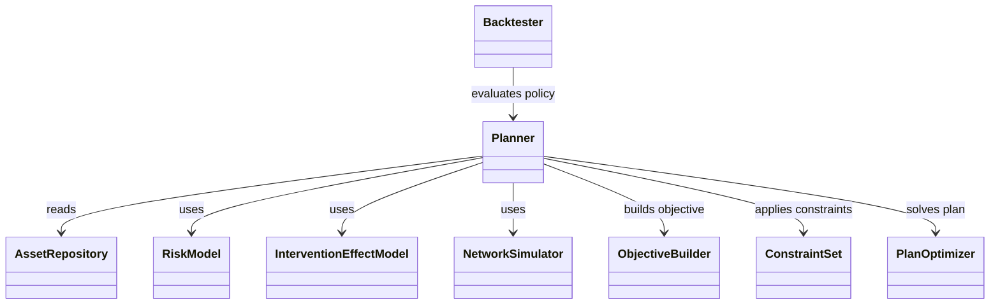
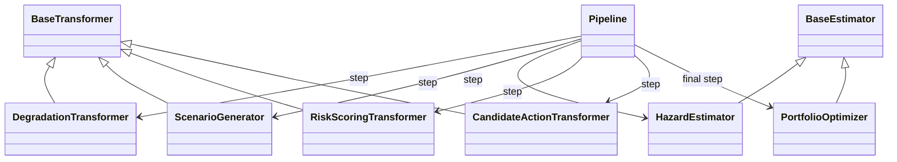
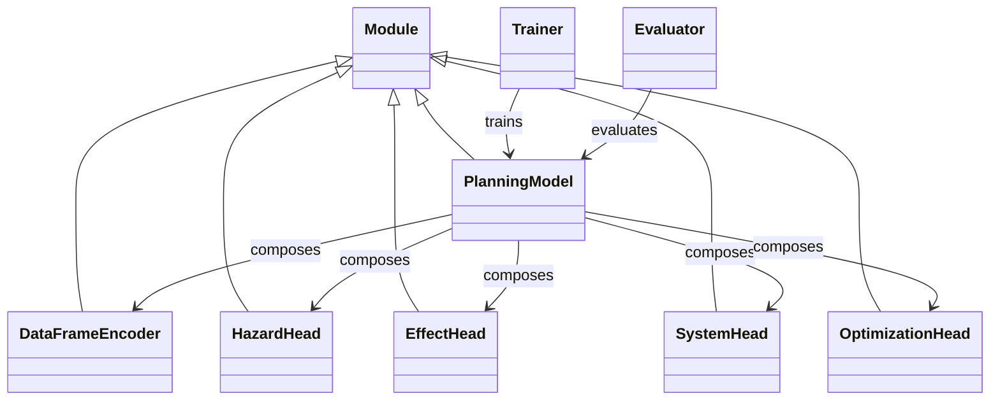
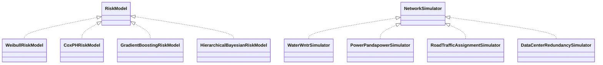
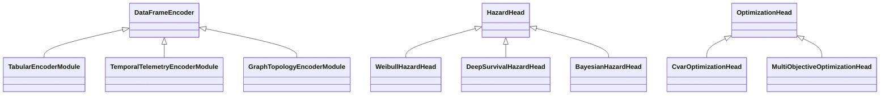

# API Design Proposals for a Unified Physical Asset Optimization Framework

## Purpose
This document expands the API examples from:
- `research/3_implementation_approaches.md`
- `research/5_financial_modeling_lessons.md`

It proposes concrete class-based APIs with method-level contracts, relationship diagrams, and rationale. The proposals are intentionally different so teams can choose based on org maturity, data platform, and modeling culture.

## Shared Design Constraints Across Proposals
- DataFrames are first-class inputs/outputs (`pandas`, `polars`, and optionally `pyspark`).
- Uncertainty is first-class (predictive distributions, scenario outputs, not only point estimates).
- Planning is separated into: risk estimation, intervention effects, optimization, execution, and backtesting.
- Domain plugins (roads/water/power/data centers) are adapters, not core architecture forks.

## Common Data Contracts (Used by All Proposals)
```python
from dataclasses import dataclass
from typing import Protocol

DataFrameLike = object  # pandas.DataFrame | polars.DataFrame | pyspark.sql.DataFrame

@dataclass(frozen=True)
class PlanningHorizon:
    start_date: str
    end_date: str
    step: str  # "monthly", "quarterly", ...

@dataclass(frozen=True)
class PlanResult:
    selected_actions: DataFrameLike
    objective_breakdown: DataFrameLike
    constraint_shadow_prices: DataFrameLike

@dataclass(frozen=True)
class ScenarioSet:
    scenarios: DataFrameLike  # scenario_id, variable, timestamp, value
```

## Proposal A: Domain-Oriented Service API (Own Proposal)
This proposal is explicit and finance-inspired: separate each decision layer into service objects with clear responsibilities.

### Core Classes and Methods
```python
class AssetRepository:
    def load_assets(self) -> DataFrameLike: ...
    def load_events(self, event_type: str | None = None) -> DataFrameLike: ...
    def load_interventions(self) -> DataFrameLike: ...

class RiskModel(Protocol):
    def fit(self, assets: DataFrameLike, events: DataFrameLike, covariates: DataFrameLike) -> "RiskModel": ...
    def predict_distribution(self, assets: DataFrameLike, horizon: PlanningHorizon, scenarios: ScenarioSet) -> DataFrameLike: ...

class InterventionEffectModel(Protocol):
    def fit(self, interventions: DataFrameLike, outcomes: DataFrameLike) -> "InterventionEffectModel": ...
    def estimate_effect(self, candidate_actions: DataFrameLike, horizon: PlanningHorizon, scenarios: ScenarioSet) -> DataFrameLike: ...

class NetworkSimulator(Protocol):
    def simulate(self, assets: DataFrameLike, failures: DataFrameLike, actions: DataFrameLike, scenarios: ScenarioSet) -> DataFrameLike: ...

class ObjectiveBuilder:
    def add_expected_risk_reduction(self, weight: float = 1.0) -> "ObjectiveBuilder": ...
    def add_cost(self, weight: float = 1.0) -> "ObjectiveBuilder": ...
    def add_resilience(self, weight: float = 1.0) -> "ObjectiveBuilder": ...
    def build(self) -> object: ...

class ConstraintSet:
    def add_budget_limit(self, annual_capex: float) -> "ConstraintSet": ...
    def add_crew_hours_limit(self, hours: float) -> "ConstraintSet": ...
    def add_outage_window(self, rule: str) -> "ConstraintSet": ...
    def add_policy_rule(self, expression: str) -> "ConstraintSet": ...

class PlanOptimizer(Protocol):
    def solve(self, objective: object, constraints: ConstraintSet, candidates: DataFrameLike, risk_measure: str = "expected_value") -> PlanResult: ...

class Planner:
    def fit(self, assets: DataFrameLike, events: DataFrameLike, interventions: DataFrameLike, covariates: DataFrameLike) -> "Planner": ...
    def propose_actions(self, horizon: PlanningHorizon, scenarios: ScenarioSet) -> DataFrameLike: ...
    def optimize_plan(self, horizon: PlanningHorizon, scenarios: ScenarioSet, constraints: ConstraintSet, risk_measure: str = "cvar") -> PlanResult: ...

class Backtester:
    def walk_forward(self, history: DataFrameLike, planner: Planner, window: str) -> DataFrameLike: ...
```

### Relationship Diagram


### Rationale
- Strongest separation of concerns and governance boundaries.
- Best fit for finance-style architecture (`risk -> optimize -> execute -> evaluate`).
- Easy to swap statistical families (Markov, survival, Bayesian, ML) via protocols.
- Good for high-stakes environments needing auditability and policy transparency.

## Proposal B: scikit-learn / sparkml Transformer-Style API + DataFrames
This proposal uses a familiar estimator/transformer pipeline for teams already comfortable with sklearn/spark paradigms.

### Core Classes and Methods
```python
class BaseTransformer:
    def fit(self, df: DataFrameLike, y: DataFrameLike | None = None) -> "BaseTransformer": ...
    def transform(self, df: DataFrameLike) -> DataFrameLike: ...

class BaseEstimator:
    def fit(self, df: DataFrameLike, y: DataFrameLike | None = None) -> "BaseEstimator": ...

class HazardEstimator(BaseEstimator):
    def predict_hazard(self, df: DataFrameLike, horizon: PlanningHorizon) -> DataFrameLike: ...
    def predict_survival(self, df: DataFrameLike, horizon: PlanningHorizon) -> DataFrameLike: ...

class DegradationTransformer(BaseTransformer):
    def transform(self, df: DataFrameLike) -> DataFrameLike: ...  # adds state transition features

class ScenarioGenerator(BaseTransformer):
    def transform(self, df: DataFrameLike) -> DataFrameLike: ...  # expands rows by scenario_id

class RiskScoringTransformer(BaseTransformer):
    def fit(self, df: DataFrameLike, y: DataFrameLike | None = None) -> "RiskScoringTransformer": ...
    def transform(self, df: DataFrameLike) -> DataFrameLike: ...  # adds risk_mean, risk_p90, etc.

class CandidateActionTransformer(BaseTransformer):
    def transform(self, df: DataFrameLike) -> DataFrameLike: ...  # candidate interventions

class PortfolioOptimizer(BaseEstimator):
    def fit(self, candidates_df: DataFrameLike, y: DataFrameLike | None = None) -> "PortfolioOptimizer": ...
    def predict(self, candidates_df: DataFrameLike) -> PlanResult: ...

class Pipeline:
    def __init__(self, steps: list[tuple[str, object]]): ...
    def fit(self, df: DataFrameLike, y: DataFrameLike | None = None) -> "Pipeline": ...
    def transform(self, df: DataFrameLike) -> DataFrameLike: ...
    def predict(self, df: DataFrameLike) -> PlanResult: ...
```

### Relationship Diagram


### Rationale
- Lowest learning curve for DS/ML teams already using `Pipeline`, `fit/transform/predict`.
- Natural interoperability with pandas/polars and spark DataFrame transforms.
- Encourages reproducible preprocessing + model steps and easier model registry integration.
- Works well for medium-complexity programs where network simulation can be wrapped as transformers.
- Main limitation: risk of forcing non-tabular operations into transformer abstractions.

## Proposal C: PyTorch-Style Callable Modules + DataFrames
This proposal makes components callable modules (`__call__`/`forward`) and composes them into a graph-like planning model.

### Core Classes and Methods
```python
class Module:
    def __call__(self, *args, **kwargs): ...
    def forward(self, *args, **kwargs): ...

class DataFrameEncoder(Module):
    def fit(self, df: DataFrameLike) -> "DataFrameEncoder": ...
    def forward(self, df: DataFrameLike) -> dict[str, object]: ...

class HazardHead(Module):
    def fit(self, encoded: dict[str, object], targets: DataFrameLike) -> "HazardHead": ...
    def forward(self, encoded: dict[str, object], horizon: PlanningHorizon, scenarios: ScenarioSet) -> DataFrameLike: ...

class EffectHead(Module):
    def fit(self, encoded: dict[str, object], outcomes: DataFrameLike) -> "EffectHead": ...
    def forward(self, encoded: dict[str, object], candidate_actions: DataFrameLike, scenarios: ScenarioSet) -> DataFrameLike: ...

class SystemHead(Module):
    def forward(self, failures: DataFrameLike, actions: DataFrameLike, topology: DataFrameLike, scenarios: ScenarioSet) -> DataFrameLike: ...

class OptimizationHead(Module):
    def forward(self, risk_df: DataFrameLike, effect_df: DataFrameLike, constraints: ConstraintSet, risk_measure: str = "cvar") -> PlanResult: ...

class PlanningModel(Module):
    def __init__(self, encoder: DataFrameEncoder, hazard: HazardHead, effect: EffectHead, system: SystemHead, optimizer: OptimizationHead): ...
    def fit(self, train_df: DataFrameLike, targets: DataFrameLike) -> "PlanningModel": ...
    def forward(self, assets_df: DataFrameLike, candidate_actions: DataFrameLike, topology_df: DataFrameLike, horizon: PlanningHorizon, scenarios: ScenarioSet, constraints: ConstraintSet) -> PlanResult: ...

class Trainer:
    def fit(self, model: PlanningModel, train_df: DataFrameLike, targets: DataFrameLike, validation_df: DataFrameLike | None = None) -> PlanningModel: ...

class Evaluator:
    def evaluate(self, model: PlanningModel, test_df: DataFrameLike, metrics: list[str]) -> DataFrameLike: ...
```

### Relationship Diagram


### Rationale
- Best for teams building complex differentiable/nonlinear models and custom training loops.
- Uniform callable semantics simplify composition and experimentation.
- Easier extension to deep models, embeddings, and graph/neural components.
- Strong path to online learning and policy-learning experiments.
- Main limitation: higher complexity for traditional asset planning teams and governance reviewers.

## Proposal Selection Guide
- Choose Proposal A when governance/auditability and policy transparency are highest priority.
- Choose Proposal B when fast adoption and compatibility with sklearn/spark DataFrame workflows are highest priority.
- Choose Proposal C when advanced modeling flexibility and callable graph composition are highest priority.

## Model and Domain Fit Matrix

### Statistical Approach Fit by Proposal
| Proposal | Classical stats (Weibull/Cox/Markov) | ML (GBM/RF/survival ML) | Bayesian/hierarchical | Network simulation | Stochastic optimization |
|---|---|---|---|---|---|
| **A: Domain-Oriented Services** | Excellent fit via `RiskModel` adapters | Excellent fit via interchangeable `RiskModel` implementations | Excellent fit; natural uncertainty-first API | Excellent fit via `NetworkSimulator` plugins | Excellent fit via explicit `PlanOptimizer` and `risk_measure` |
| **B: sklearn/spark Transformer Pipeline** | Strong fit as estimators/transformers | Strongest fit for tabular pipelines | Moderate fit; posterior workflows are less native | Moderate fit; simulators can be wrapped as transformers | Moderate fit; optimizer as final estimator |
| **C: PyTorch Callable Modules** | Good fit, often overkill for simple workflows | Strong fit, especially with nonlinear/high-dimensional signals | Strong fit for advanced probabilistic/deep approaches | Good fit with learned surrogates or wrapped simulators | Strong fit for custom objectives and training loops |

### Domain and Use-Case Fit by Proposal
| Domain / use case | Best proposal | Why | Typical model stack |
|---|---|---|---|
| Roads/bridges annual renewal planning | **B or A** | Mostly tabular condition workflows with transparent optimization | Markov/degradation + consequence model + constrained optimizer |
| Water networks (pump/pipe + flood/pressure impacts) | **A** | Clear separation of risk, hydraulic simulation, and planning constraints | Survival or hierarchical risk + network simulation + CVaR optimization |
| Power T&D reliability planning (N-1, outage constraints) | **A** | Governance and explicit constraint/objective composition are critical | Hazard/degradation + contingency simulation + stochastic portfolio optimization |
| Data center predictive maintenance (high telemetry cadence) | **C or B** | Fast reprioritization; C adds advanced modeling flexibility | Survival ML/deep features + scenario stress + rolling optimizer |
| Sparse, high-criticality portfolios | **A** | Strong uncertainty governance and auditable policy decisions | Hierarchical Bayesian + scenario engine + risk-budgeted optimizer |
| Research-heavy experimentation (embeddings/GNN/policy learning) | **C** | Callable graph composition with custom losses and modules | Deep survival + graph modules + custom optimization heads |

## Illustrative Examples

Each example below uses the same comparison dimensions so Proposal A/B/C are easier to scan.

### Example 1: Road Segment Renewal Program
- Use case: annual resurfacing/reconstruction prioritization for 50k segments.
- Data shape: tabular inspection and traffic features in `pandas` or `spark`.

| Dimension | Proposal A (Domain Services) | Proposal B (sklearn/spark Pipeline) | Proposal C (PyTorch Modules) |
|---|---|---|---|
| Core flow | `RiskModel` for deterioration/hazard -> `Planner.propose_actions` -> `PlanOptimizer.solve` with budget/possession constraints | `DegradationTransformer -> ScenarioGenerator -> HazardEstimator -> RiskScoringTransformer -> CandidateActionTransformer -> PortfolioOptimizer` | `DataFrameEncoder -> HazardHead + EffectHead -> OptimizationHead` |
| Best statistical fit | Markov, Weibull/Cox, simple hierarchical effects | Markov/survival ML/GBM on tabular features | Deep or hybrid models, often more than needed |
| Strengths | Clear planning audit trail and policy transparency | Fastest for tabular DS workflows and reproducible transforms | Flexible for frequent refreshes and richer representations |
| Tradeoffs | More orchestration code than a single pipeline | Can feel constrained if logic is not tabular | Higher engineering complexity and governance overhead |

### Example 2: Pump and Pipe Replacement Under Flood Risk
- Use case: choose annual interventions that minimize expected flood service loss under budget/crew constraints.
- Data shape: asset tables + event history + topology + storm scenarios.

| Dimension | Proposal A (Domain Services) | Proposal B (sklearn/spark Pipeline) | Proposal C (PyTorch Modules) |
|---|---|---|---|
| Core flow | `RiskModel.predict_distribution` + `InterventionEffectModel.estimate_effect` + `NetworkSimulator.simulate` + `PlanOptimizer.solve(risk_measure="cvar")` | Wrap hydraulic simulation as a transformer stage, then solve with final `PortfolioOptimizer` estimator | `SystemHead` invokes simulator or surrogate, combines with risk/effect heads, then `OptimizationHead` computes CVaR-aware plan |
| Best statistical fit | Survival + hierarchical Bayesian + stochastic optimization | Survival/GBM features plus scenario-expanded tables | Learned surrogates or deep hybrids with custom objective training |
| Strengths | Clean separation between risk, simulation, and optimization | Familiar pipeline operations on DataFrames | Strong for nonlinear interaction learning and custom losses |
| Tradeoffs | Requires explicit contracts between modules | Simulator-in-transformer pattern can be awkward | Harder to explain to non-ML stakeholders |

### Example 3: Data Center Maintenance Replanning Every Week
- Use case: short-cycle reprioritization of UPS/chiller maintenance using dense telemetry.
- Data shape: high-frequency sensor summaries and event labels as DataFrames.

| Dimension | Proposal A (Domain Services) | Proposal B (sklearn/spark Pipeline) | Proposal C (PyTorch Modules) |
|---|---|---|---|
| Core flow | Telemetry-aware `RiskModel` + `InterventionEffectModel` -> `Planner.optimize_plan` weekly | Feature pipeline + survival/GBM estimator -> weekly `PortfolioOptimizer.predict` | Train `PlanningModel(encoder, hazard, effect, system, optimizer)` via `Trainer.fit`, then call `model(...)` weekly |
| Best statistical fit | Survival ML + scenario stress + constrained optimization | GBM/RF/survival ML in tabular pipelines | Deep temporal/representation models and callable compositions |
| Strengths | Stable interfaces with strong operational controls | Fastest implementation and easy monitoring | Highest modeling flexibility and low-latency inference paths |
| Tradeoffs | Less flexible for rapid model experimentation | Limited expressiveness for complex structured models | Highest maintenance burden for model/training infrastructure |

### Example 4: Sparse Critical Grid Assets with Regulator Review
- Use case: transformer replacement where failures are rare but high consequence.
- Data shape: sparse failure history across regions and manufacturers.

| Dimension | Proposal A (Domain Services) | Proposal B (sklearn/spark Pipeline) | Proposal C (PyTorch Modules) |
|---|---|---|---|
| Core flow | Hierarchical Bayesian `RiskModel` + stress `ScenarioSet` + explicit `ObjectiveBuilder/ConstraintSet` + `Backtester.walk_forward` | Bayesian estimation wrapped as estimator/transformer, posterior summaries routed to optimizer | `DataFrameEncoder` for shared representations + uncertainty-aware `HazardHead` + evaluator artifacts |
| Best statistical fit | Hierarchical Bayesian and scenario-based decisioning | Posterior-summary workflows mixed with tabular optimization | Bayesian-deep hybrids where representation sharing helps sparse data |
| Strengths | Best auditability and regulator-facing traceability | Reuses pipeline infrastructure where already adopted | Can capture subtle cross-asset structure when data is sparse |
| Tradeoffs | Slower to implement initially | Posterior uncertainty handling can feel indirect | Hardest to justify and validate in conservative governance settings |

## Extensive Plugin Illustrations

### Proposal A: Service Adapters with Concrete Plugins
| Extension point | Example subclasses / plugins | Typical use |
|---|---|---|
| `RiskModel` | `WeibullRiskModel`, `CoxPHRiskModel`, `GradientBoostingRiskModel`, `HierarchicalBayesianRiskModel` | Classical reliability, ML ranking, sparse-data Bayesian uncertainty |
| `InterventionEffectModel` | `RuleBasedEffectModel`, `CausalForestEffectModel`, `BayesianTreatmentEffectModel` | Deterministic policy effects, causal uplift, uncertainty-aware treatment impact |
| `NetworkSimulator` | `WaterWntrSimulator`, `PowerPandapowerSimulator`, `RoadTrafficAssignmentSimulator`, `DataCenterRedundancySimulator` | Domain consequence propagation |
| `PlanOptimizer` | `GreedyBudgetOptimizer`, `MilpPlanOptimizer`, `CvarScenarioOptimizer`, `RobustMinMaxOptimizer` | Fast heuristics, exact MILP, tail-risk control, robust planning |



### Proposal B: Transformer/Estimator Subclass Catalog
| Base type | Example subclasses / plugins | Typical use |
|---|---|---|
| `BaseTransformer` | `AssetSchemaValidator`, `ConditionStateFeatureTransformer`, `TrafficClimateFeatureTransformer`, `TemporalFeatureTransformer`, `ScenarioExpansionTransformer`, `HydraulicImpactTransformer`, `PosteriorSummaryTransformer`, `CandidateActionTransformer` | Validation, feature engineering, scenario expansion, simulator wrapping, candidate generation |
| `BaseEstimator` | `CoxHazardEstimator`, `GradientBoostingHazardEstimator`, `BayesianHazardEstimatorWrapper`, `MilpPortfolioEstimator`, `CvarPortfolioEstimator` | Hazard estimation and final constrained portfolio selection |

```mermaid
classDiagram
    class BaseTransformer
    class AssetSchemaValidator
    class ConditionStateFeatureTransformer
    class TemporalFeatureTransformer
    class ScenarioExpansionTransformer
    class HydraulicImpactTransformer
    class CandidateActionTransformer
    BaseTransformer <|-- AssetSchemaValidator
    BaseTransformer <|-- ConditionStateFeatureTransformer
    BaseTransformer <|-- TemporalFeatureTransformer
    BaseTransformer <|-- ScenarioExpansionTransformer
    BaseTransformer <|-- HydraulicImpactTransformer
    BaseTransformer <|-- CandidateActionTransformer

    class BaseEstimator
    class CoxHazardEstimator
    class GradientBoostingHazardEstimator
    class BayesianHazardEstimatorWrapper
    class MilpPortfolioEstimator
    class CvarPortfolioEstimator
    BaseEstimator <|-- CoxHazardEstimator
    BaseEstimator <|-- GradientBoostingHazardEstimator
    BaseEstimator <|-- BayesianHazardEstimatorWrapper
    BaseEstimator <|-- MilpPortfolioEstimator
    BaseEstimator <|-- CvarPortfolioEstimator
```



### Proposal C: Callable Module Plugin Catalog
| Module family | Example subclasses / plugins | Typical use |
|---|---|---|
| `DataFrameEncoder` | `TabularEncoderModule`, `TemporalTelemetryEncoderModule`, `GraphTopologyEncoderModule` | Structured tabular, temporal sensor, and topology-aware encodings |
| `HazardHead` | `WeibullHazardHead`, `DeepSurvivalHazardHead`, `BayesianHazardHead` | Classical hazard, neural survival, uncertainty-aware Bayesian hazard |
| `EffectHead` | `RuleBasedEffectHead`, `CausalEffectHead` | Operational policy effects and learned uplift |
| `SystemHead` | `HydraulicSurrogateSystemHead`, `ContingencyPowerSystemHead`, `RoadDisruptionSystemHead`, `DataCenterSystemHead` | Fast system-impact estimation |
| `OptimizationHead` | `CvarOptimizationHead`, `MultiObjectiveOptimizationHead` | Tail-risk minimization and weighted-objective planning |



### Domain Wiring Blueprints (Same Use Case, Different Proposal)
| Example | Proposal A concrete wiring | Proposal B concrete wiring | Proposal C concrete wiring |
|---|---|---|---|
| Roads renewal | `CoxPHRiskModel + RuleBasedEffectModel + RoadTrafficAssignmentSimulator + MilpPlanOptimizer` | `ConditionStateFeatureTransformer -> TrafficClimateFeatureTransformer -> CoxHazardEstimator -> CandidateActionTransformer -> MilpPortfolioEstimator` | `TabularEncoderModule + WeibullHazardHead + RuleBasedEffectHead + RoadDisruptionSystemHead + MultiObjectiveOptimizationHead` |
| Water flood risk | `HierarchicalBayesianRiskModel + BayesianTreatmentEffectModel + WaterWntrSimulator + CvarScenarioOptimizer` | `ScenarioExpansionTransformer -> HydraulicImpactTransformer -> BayesianHazardEstimatorWrapper -> CandidateActionTransformer -> CvarPortfolioEstimator` | `GraphTopologyEncoderModule + BayesianHazardHead + CausalEffectHead + HydraulicSurrogateSystemHead + CvarOptimizationHead` |
| Data center weekly planning | `GradientBoostingRiskModel + CausalForestEffectModel + DataCenterRedundancySimulator + GreedyBudgetOptimizer` | `AssetSchemaValidator -> TemporalFeatureTransformer -> GradientBoostingHazardEstimator -> CandidateActionTransformer -> MilpPortfolioEstimator` | `TemporalTelemetryEncoderModule + DeepSurvivalHazardHead + CausalEffectHead + DataCenterSystemHead + MultiObjectiveOptimizationHead` |
| Sparse critical grid | `HierarchicalBayesianRiskModel + BayesianTreatmentEffectModel + PowerPandapowerSimulator + RobustMinMaxOptimizer` | `PosteriorSummaryTransformer -> BayesianHazardEstimatorWrapper -> CandidateActionTransformer -> CvarPortfolioEstimator` | `GraphTopologyEncoderModule + BayesianHazardHead + RuleBasedEffectHead + ContingencyPowerSystemHead + CvarOptimizationHead` |

### Concrete Instantiation Sketches
```python
# Proposal A (water network)
planner = Planner(
    risk_model=HierarchicalBayesianRiskModel(),
    effect_model=BayesianTreatmentEffectModel(),
    simulator=WaterWntrSimulator(),
    optimizer=CvarScenarioOptimizer(),
)
```

```python
# Proposal B (roads)
pipeline = Pipeline(
    steps=[
        ("features", ConditionStateFeatureTransformer()),
        ("hazard", CoxHazardEstimator()),
        ("candidates", CandidateActionTransformer()),
        ("portfolio", MilpPortfolioEstimator()),
    ]
)
```

```python
# Proposal C (data center)
model = PlanningModel(
    encoder=TemporalTelemetryEncoderModule(),
    hazard=DeepSurvivalHazardHead(),
    effect=CausalEffectHead(),
    system=DataCenterSystemHead(),
    optimizer=MultiObjectiveOptimizationHead(),
)
```

## Recommended Path for This Repo
1. Start with Proposal A interfaces as the stable domain API.
2. Provide Proposal B wrappers for easy onboarding and notebook workflows.
3. Add Proposal C modules only for high-value domains needing advanced modeling capacity.

This staged path preserves clarity while allowing future model sophistication.
