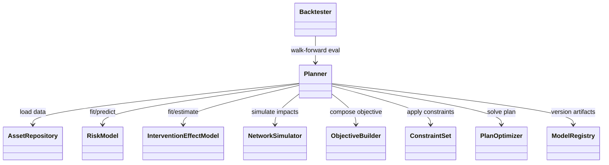
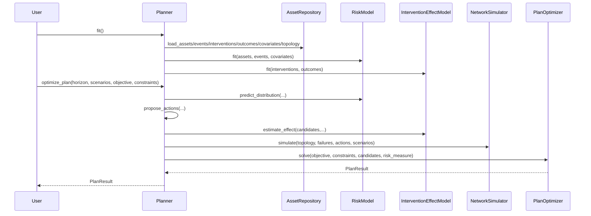

# Proposal A Specification: Domain-Oriented Service API

## Status
Draft v0.1 (architecture and interface spec)

## Purpose
Define a concrete, implementation-ready specification for Proposal A from `research/6_api_design_proposals.md`.

This proposal standardizes a domain-oriented planning framework with explicit service boundaries:
1. Risk estimation
2. Intervention effect estimation
3. Network consequence simulation
4. Portfolio optimization
5. Backtesting and governance

## Design Goals
- Support multiple statistical families (classical, ML, Bayesian) through interchangeable service adapters.
- Keep uncertainty first-class in model outputs and planning decisions.
- Keep decision logic auditable with explicit objective and constraint composition.
- Keep domain specifics pluggable (roads, water, power, data center).
- Use DataFrame-first contracts (`pandas`, `polars`, optionally `spark`) for interoperability.

## Non-Goals
- Defining solver internals for each optimization backend.
- Defining domain simulator physics internals.
- Backward compatibility guarantees (pre-release SDK).

## System Architecture


## Core Types and Contracts

### DataFrame Alias
```python
DataFrameLike = object  # pandas.DataFrame | polars.DataFrame | pyspark.sql.DataFrame
```

### Core Dataclasses
```python
from dataclasses import dataclass

@dataclass(frozen=True)
class PlanningHorizon:
    start_date: str
    end_date: str
    step: str  # "monthly" | "quarterly" | "yearly"

@dataclass(frozen=True)
class PlanResult:
    selected_actions: DataFrameLike
    objective_breakdown: DataFrameLike
    constraint_shadow_prices: DataFrameLike
    metadata: dict

@dataclass(frozen=True)
class ScenarioSet:
    scenarios: DataFrameLike  # scenario_id, variable, timestamp, value, probability

@dataclass(frozen=True)
class ValidationReport:
    passed: bool
    checks: DataFrameLike
    warnings: list[str]
```

### Service Interfaces
```python
from typing import Protocol

class AssetRepository(Protocol):
    def load_assets(self) -> DataFrameLike: ...
    def load_events(self, event_type: str | None = None) -> DataFrameLike: ...
    def load_interventions(self) -> DataFrameLike: ...
    def load_outcomes(self) -> DataFrameLike: ...
    def load_covariates(self) -> DataFrameLike: ...
    def load_topology(self) -> DataFrameLike: ...

class RiskModel(Protocol):
    def fit(self, assets: DataFrameLike, events: DataFrameLike, covariates: DataFrameLike) -> "RiskModel": ...
    def predict_distribution(
        self,
        assets: DataFrameLike,
        horizon: PlanningHorizon,
        scenarios: ScenarioSet,
    ) -> DataFrameLike: ...
    def describe(self) -> dict: ...

class InterventionEffectModel(Protocol):
    def fit(self, interventions: DataFrameLike, outcomes: DataFrameLike) -> "InterventionEffectModel": ...
    def estimate_effect(
        self,
        candidate_actions: DataFrameLike,
        horizon: PlanningHorizon,
        scenarios: ScenarioSet,
    ) -> DataFrameLike: ...
    def describe(self) -> dict: ...

class NetworkSimulator(Protocol):
    def simulate(
        self,
        topology: DataFrameLike,
        failures: DataFrameLike,
        actions: DataFrameLike,
        scenarios: ScenarioSet,
    ) -> DataFrameLike: ...

class PlanOptimizer(Protocol):
    def solve(
        self,
        objective: object,
        constraints: "ConstraintSet",
        candidates: DataFrameLike,
        risk_measure: str = "expected_value",
    ) -> PlanResult: ...

class Backtester(Protocol):
    def walk_forward(
        self,
        history: DataFrameLike,
        planner: "Planner",
        window: str,
    ) -> DataFrameLike: ...
```

## Objective and Constraint DSL

### ObjectiveBuilder
```python
class ObjectiveBuilder:
    def add_expected_risk_reduction(self, weight: float = 1.0) -> "ObjectiveBuilder": ...
    def add_total_cost(self, weight: float = 1.0) -> "ObjectiveBuilder": ...
    def add_resilience_gain(self, weight: float = 1.0) -> "ObjectiveBuilder": ...
    def add_equity_term(self, weight: float = 1.0, group_column: str = "region") -> "ObjectiveBuilder": ...
    def build(self) -> object: ...
```

### ConstraintSet
```python
class ConstraintSet:
    def add_budget_limit(self, annual_capex: float, period: str = "annual") -> "ConstraintSet": ...
    def add_crew_hours_limit(self, hours: float) -> "ConstraintSet": ...
    def add_outage_windows(self, rules: DataFrameLike) -> "ConstraintSet": ...
    def add_policy_rule(self, expression: str) -> "ConstraintSet": ...
    def add_minimum_service_level(self, metric: str, threshold: float) -> "ConstraintSet": ...
```

## Planner Lifecycle

### Orchestration API
```python
class Planner:
    def __init__(
        self,
        repository: AssetRepository,
        risk_model: RiskModel,
        effect_model: InterventionEffectModel,
        simulator: NetworkSimulator,
        optimizer: PlanOptimizer,
        registry: "ModelRegistry | None" = None,
    ): ...

    def validate_inputs(self) -> ValidationReport: ...

    def fit(self) -> "Planner": ...

    def propose_actions(
        self,
        horizon: PlanningHorizon,
        scenarios: ScenarioSet,
    ) -> DataFrameLike: ...

    def optimize_plan(
        self,
        horizon: PlanningHorizon,
        scenarios: ScenarioSet,
        objective: object,
        constraints: ConstraintSet,
        risk_measure: str = "cvar",
    ) -> PlanResult: ...
```

### Execution Sequence


## Data Contracts (Required Columns)

### Assets
| Column | Type | Required | Notes |
|---|---|---|---|
| `asset_id` | string | yes | stable unique key |
| `asset_type` | string | yes | pipe, pump, transformer, road_segment, etc. |
| `install_date` | date/string | yes | commissioning date |
| `criticality` | numeric/string | yes | domain-normalized criticality indicator |
| `region` | string | recommended | geography/business grouping |

### Events
| Column | Type | Required | Notes |
|---|---|---|---|
| `asset_id` | string | yes | foreign key to assets |
| `event_type` | string | yes | failure, inspection, maintenance |
| `event_timestamp` | datetime | yes | event time |
| `event_value` | numeric/string | optional | condition score, severity, etc. |

### Candidate Actions
| Column | Type | Required | Notes |
|---|---|---|---|
| `asset_id` | string | yes | target asset |
| `action_id` | string | yes | unique action identifier |
| `action_type` | string | yes | repair/replace/inspect/harden |
| `direct_cost` | float | yes | intervention cost |
| `crew_hours` | float | recommended | resource requirement |
| `outage_hours` | float | recommended | service disruption |

### Risk Distribution Output (RiskModel)
| Column | Type | Required | Notes |
|---|---|---|---|
| `asset_id` | string | yes | target asset |
| `scenario_id` | string | yes | scenario label |
| `horizon_step` | string/int | yes | monthly/quarterly step |
| `failure_prob` | float | yes | probability in step |
| `loss_mean` | float | yes | expected consequence |
| `loss_p90` | float | recommended | tail measure |

### Plan Output (PlanResult.selected_actions)
| Column | Type | Required | Notes |
|---|---|---|---|
| `asset_id` | string | yes | selected asset |
| `action_id` | string | yes | selected action |
| `scheduled_period` | string | yes | schedule bucket |
| `expected_benefit` | float | yes | expected risk reduction/service value |
| `selected_cost` | float | yes | realized planning cost |
| `selection_reason` | string | recommended | explainability string |

## Plugin System

### Default Plugin Registry (Recommended)
```python
RISK_MODELS = {
    "weibull": WeibullRiskModel,
    "cox_ph": CoxPHRiskModel,
    "gbm": GradientBoostingRiskModel,
    "hb": HierarchicalBayesianRiskModel,
}

EFFECT_MODELS = {
    "rule": RuleBasedEffectModel,
    "causal_forest": CausalForestEffectModel,
    "bayesian": BayesianTreatmentEffectModel,
}

SIMULATORS = {
    "water": WaterWntrSimulator,
    "power": PowerPandapowerSimulator,
    "roads": RoadTrafficAssignmentSimulator,
    "datacenter": DataCenterRedundancySimulator,
}

OPTIMIZERS = {
    "greedy": GreedyBudgetOptimizer,
    "milp": MilpPlanOptimizer,
    "cvar": CvarScenarioOptimizer,
    "robust": RobustMinMaxOptimizer,
}
```

## Governance and Model Registry

### ModelRegistry API
```python
class ModelRegistry(Protocol):
    def register_fit(self, component: str, version: str, metadata: dict) -> None: ...
    def load(self, component: str, version: str) -> object: ...
    def latest(self, component: str) -> str: ...
```

### Governance Requirements
- Every `fit()` call must log:
  - training window
  - feature set / covariates
  - model version hash
  - calibration summary
- Every `optimize_plan()` call must log:
  - objective terms and weights
  - active constraints
  - risk measure (`expected_value`, `cvar`, etc.)
  - scenario set identifier
- Backtester must support rolling-origin walk-forward evaluation and produce out-of-sample metrics.

## Validation Rules
- Reject missing required columns with a typed validation error.
- Reject duplicate `asset_id` in asset registry.
- Reject candidate actions that reference unknown assets.
- Reject scenarios without probabilities when risk measure needs weighted expectation.
- Reject negative direct costs or impossible schedules.

## Exception Model
Use custom exceptions from `src/asset_optimization/exceptions.py`.

Recommended mapping:
- Schema/column errors -> `ValidationError`
- Incompatible plugin outputs -> `ModelError`
- Unsatisfiable constraints/optimization infeasible -> `OptimizationError`

## Reference Domain Configurations

### Roads (annual planning)
- `risk_model`: `CoxPHRiskModel`
- `effect_model`: `RuleBasedEffectModel`
- `simulator`: `RoadTrafficAssignmentSimulator`
- `optimizer`: `MilpPlanOptimizer`
- `risk_measure`: `expected_value`

### Water (flood resilience)
- `risk_model`: `HierarchicalBayesianRiskModel`
- `effect_model`: `BayesianTreatmentEffectModel`
- `simulator`: `WaterWntrSimulator`
- `optimizer`: `CvarScenarioOptimizer`
- `risk_measure`: `cvar`

### Data Center (weekly reprioritization)
- `risk_model`: `GradientBoostingRiskModel`
- `effect_model`: `CausalForestEffectModel`
- `simulator`: `DataCenterRedundancySimulator`
- `optimizer`: `GreedyBudgetOptimizer`
- `risk_measure`: `expected_value`

## Minimal End-to-End Usage
```python
planner = Planner(
    repository=ParquetAssetRepository(base_path="data/"),
    risk_model=HierarchicalBayesianRiskModel(),
    effect_model=BayesianTreatmentEffectModel(),
    simulator=WaterWntrSimulator(),
    optimizer=CvarScenarioOptimizer(),
    registry=SqlModelRegistry("sqlite:///model_registry.db"),
)

report = planner.validate_inputs()
if not report.passed:
    raise RuntimeError(report.warnings)

planner.fit()

objective = (
    ObjectiveBuilder()
    .add_expected_risk_reduction(weight=1.0)
    .add_total_cost(weight=0.2)
    .add_resilience_gain(weight=0.4)
    .build()
)

constraints = (
    ConstraintSet()
    .add_budget_limit(annual_capex=5_000_000)
    .add_crew_hours_limit(hours=80_000)
)

result = planner.optimize_plan(
    horizon=PlanningHorizon(start_date="2027-01-01", end_date="2027-12-31", step="monthly"),
    scenarios=scenario_set,
    objective=objective,
    constraints=constraints,
    risk_measure="cvar",
)
```

## Implementation Phases
1. Phase 1 (MVP): contracts, validation, one plugin per extension point, deterministic optimization.
2. Phase 2: scenario engine integration, CVaR optimizer, backtester walk-forward.
3. Phase 3: hierarchical Bayesian risk and effect models, registry-driven governance reports.
4. Phase 4: multi-domain plugin packs and policy monitoring dashboards.
